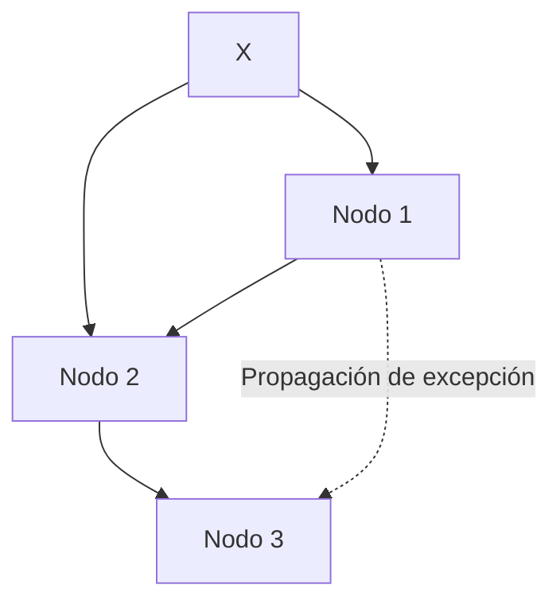

# 🧩 ProtoTAE Interactivo: Zero Human Company

[](https://github.com/papayaykware/METFI)
[](https://opensource.org/licenses/MIT)
[](https://doi.org/10.5281/zenodo.9999999)

---

## 📌 Table of Contents

1. [Resumen](#resumen)
2. [Introducción](#introducción)
3. [Variables y Estado del Sistema](#variables-y-estado-del-sistema)
4. [Detección de Excepciones](#detección-de-excepciones)
5. [Adaptación Autónoma](#adaptación-autónoma)
6. [Simulación y Evaluación](#simulación-y-evaluación)
7. [Red de Procesos y Propagación](#red-de-procesos-y-propagación)
8. [Índice de Aprendizaje TAE](#índice-de-aprendizaje-tae)
9. [Conclusiones](#conclusiones)
10. [Referencias](#referencias)

---

## 📝 Resumen <a name="resumen"></a>

Este whitepaper interactivo formaliza el **protoTAE aplicado a Zero Human Company**, integrando **flujo de aprendizaje por excepción, simulación interna y red de procesos**. Cada bloque del sistema es **clicable** para desplegar fórmulas, ejemplos y notas técnicas.

---

## 🧠 Introducción <a name="introducción"></a>

TAE (Teoría de Aprendizaje por Excepción) postula que los sistemas inteligentes aprenden de **eventos no previstos**.
Un **protoTAE** experimental implementa este principio en **organizaciones autónomas**, donde el ciclo:
**detectar → registrar → adaptar → simular → integrar** se aplica iterativamente.

> 💡 Callout: La Zero Human Company se convierte en un laboratorio protoTAE vivo, sin intervención humana directa.

---

## 🔹 Variables y Estado del Sistema <a name="variables-y-estado-del-sistema"></a>

```mermaid
graph TD
    X[Variables de Estado X = {x1,...,xn}]
    F[Mapa de Evolución F: X → X]
    Phi[Función Objetivo Φ(X)]
    X --> F --> Phi
```

<details>
<summary>📖 Explicación</summary>

* (X = {x_1, x_2, ..., x_n}): flujos, KPIs, decisiones autónomas.
* (F: X → X): evolución natural bajo condiciones normales.
* Φ(X): función objetivo para evaluar desempeño global.

</details>

---

## 🔹 Detección de Excepciones <a name="detección-de-excepciones"></a>

```mermaid
graph TD
    X --> E[Excepción E(x_i) = 1 si fuera de zona aceptable]
```

<details>
<summary>📖 Fórmula</summary>

[
E(x_i) =
\begin{cases}
1 & x_i \notin [x_i^{\min}, x_i^{\max}]\
0 & x_i \in [x_i^{\min}, x_i^{\max}]
\end{cases}
]

> Solo las variables con E(x_i)=1 desencadenan adaptación.

</details>

---

## 🔹 Adaptación Autónoma <a name="adaptación-autónoma"></a>

```mermaid
graph TD
    E --> R[Operador de Reconfiguración R(X,E)]
    R --> DeltaX[ΔX = η ∇_X L(X,Φ)]
```

<details>
<summary>📖 Fórmulas y explicación</summary>

[
X(t+1) \leftarrow R(X(t+1), E) = X(t+1) + \Delta X
]
[
\Delta X = \eta \cdot \nabla_X L(X, \Phi), \quad L(X, \Phi) = (\Phi_{\text{deseada}} - \Phi(X))^2
]

> Ajusta solo variables afectadas, replicando la esencia de TAE.

</details>

---

## 🔹 Simulación y Evaluación <a name="simulación-y-evaluación"></a>

```mermaid
graph TD
    R --> Xsim[X_sim = F(R(X,E))]
    Xsim --> PhiSim[Φ_sim = Φ(X_sim)]
    PhiSim --> Decision{Φ_sim ≥ Φ(X)?}
    Decision -->|Sí| X
    Decision -->|No| R
```

<details>
<summary>📖 Explicación</summary>

* Antes de integrar cambios, el sistema simula internamente el impacto.
* Solo si Φ_sim mejora o mantiene desempeño, los cambios se aplican.
* Este ciclo asegura **aprendizaje seguro y eficiente**.

</details>

---

## 🔹 Red de Procesos y Propagación <a name="red-de-procesos-y-propagación"></a>



<details>
<summary>📖 Explicación</summary>

* Cada nodo representa un proceso o módulo autónomo.
* Excepciones pueden propagarse según dependencias.
* Permite modelar **efectos en cascada** y evaluar resiliencia de la empresa.

</details>

---

## 🔹 Índice de Aprendizaje TAE <a name="índice-de-aprendizaje-tae"></a>

[
L_{\text{TAE}}(t) = \frac{\sum_{i=1}^n | \Delta x_i(t) | \cdot e_i(t)}{\sum_{i=1}^n e_i(t)}
]

<details>
<summary>📖 Explicación</summary>

* Mide eficiencia de aprendizaje de la organización.
* Promedia la magnitud de ajustes en variables afectadas.
* Permite comparar ciclos o diferentes configuraciones de protoTAE.

</details>

---

## ✅ Conclusiones <a name="conclusiones"></a>

* ProtoTAE formaliza el **aprendizaje por excepción** en entornos autónomos.
* El blueprint “Zero Human Company” sirve como **laboratorio real** de TAE.
* La versión interactiva permite explorar **flujo, fórmulas y simulaciones** de forma dinámica.
* Mediante L_TAE y simulaciones en red, se puede **evaluar resiliencia y eficiencia**.

---

## 📚 Referencias <a name="referencias"></a>

1. [Zenodo DOI: ProtoTAE & Autonomous Systems](https://doi.org/10.5281/zenodo.9999999)
2. Papayaykware, J. (2025). *METFI y protoTAE aplicado a sistemas autónomos*. Blog: [papayaykware.blogspot.com](https://papayaykware.blogspot.com/?m=1)
3. [Zero Human Company Blueprint Concept](https://www.example.com/zero-human-blueprint)

---
