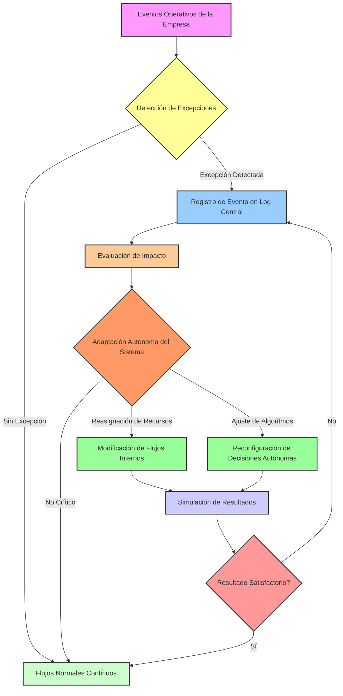

# 🧩 ProtoTAE aplicado: The Zero Human Company Blueprint

---

## 📌 Table of Contents

1. [Resumen](#resumen)
2. [Introducción](#introducción)
3. [Conceptos clave: protoTAE](#conceptos-clave-prototae)
4. [The Zero Human Company Blueprint](#the-zero-human-company-blueprint)
5. [Integración con protoTAE](#integración-con-prototae)
6. [Diagrama conceptual](#diagrama-conceptual)
7. [Flujo de aprendizaje por excepción](#flujo-de-aprendizaje-por-excepción)
8. [Notas colapsables](#notas-colapsables)
9. [Conclusiones](#conclusiones)
10. [Referencias](#referencias)

---

## 📝 Resumen

Este documento establece un marco conceptual para integrar el **experimento The Zero Human Company Blueprint** dentro de un **protoTAE**. Se demuestra cómo los flujos autónomos de detección de excepciones, retroalimentación y adaptación de procesos empresariales pueden funcionar como un laboratorio incipiente de **aprendizaje por excepción**, ofreciendo insights para sistemas autónomos organizacionales y arquitecturas de AGI-TAE.

**Palabras clave:** protoTAE, aprendizaje por excepción, automatización empresarial, Zero Human Company, retroalimentación autónoma, adaptabilidad.

---

## 🧠 Introducción

La **Teoría de Aprendizaje por Excepción (TAE)** establece que los sistemas inteligentes aprenden principalmente de **eventos no esperados o excepciones**, en lugar de seguir patrones estándar. Un **protoTAE** es su manifestación experimental: el sistema detecta anomalías y ajusta sus flujos internos, aunque aún no esté formalizado matemáticamente.

El **experimento Zero Human Company** es ideal para un protoTAE porque minimiza intervención humana, dejando que el sistema mismo identifique, registre y aprenda de excepciones.

---

## 🔑 Conceptos clave: protoTAE

* **Excepción:** cualquier desviación relevante de objetivos, métricas o patrones esperados.
* **Retroalimentación autónoma:** ajustes automáticos del sistema basados en la detección de excepciones.
* **Reconfiguración interna:** modificación de flujos, asignación de recursos y algoritmos para adaptarse.
* **Ciclo de aprendizaje:** detección → registro → evaluación → adaptación → simulación → integración.

---

## 🏢 The Zero Human Company Blueprint

Este blueprint define una **empresa autónoma o semi-autónoma**:

* Procesos gestionados sin intervención humana directa.
* Flujo de información y decisiones automatizado.
* Registro continuo de anomalías y KPIs.
* Evaluación interna y simulación de ajustes antes de implementación.

> 💡 **Callout:** La filosofía subyacente es convertir la organización en un **laboratorio de aprendizaje autónomo**, donde cada evento inesperado es una oportunidad de aprendizaje.

---

## ⚡ Integración con protoTAE

| Componente TAE             | Correspondencia en el Blueprint                                             |
| -------------------------- | --------------------------------------------------------------------------- |
| Detección de excepciones   | Algoritmos identifican desviaciones de KPIs o procesos fallidos.            |
| Registro de eventos        | Logging centralizado para análisis histórico.                               |
| Adaptación autónoma        | Ajuste de flujos, reasignación de recursos y modificación de algoritmos.    |
| Simulación de resultados   | Evaluación de impacto antes de aplicar cambios.                             |
| Retroalimentación continua | Cada excepción se convierte en dato para el siguiente ciclo de aprendizaje. |

> 🔹 El sistema se comporta como **protoTAE vivo**, aún experimental pero funcional.

---

## 🗺️ Diagrama conceptual

---

## 🔄 Flujo de aprendizaje por excepción

1. **Eventos operativos** → Entrada de datos.
2. **Detección de excepciones** → Identificación de anomalías.
3. **Registro central** → Historial para análisis.
4. **Evaluación de impacto** → Prioriza las acciones.
5. **Adaptación autónoma** → Ajuste de flujos, recursos y algoritmos.
6. **Simulación de resultados** → Validación interna.
7. **Integración o re-registro** → Se retroalimenta el sistema, cerrando el ciclo TAE.

> 💡 **Callout:** El núcleo TAE es el ciclo C → F → I → J → C, donde cada iteración refina el sistema.

---

## 📝 Notas colapsables

🔍 Nota 1: Métricas de excepción

- KPIs desviados > 5%  
- Fallos de flujo críticos  
- Alertas de consistencia interna  
- Indicadores de eficiencia decreciente

🔍 Nota 2: Simulación interna

- Antes de aplicar cambios reales, el sistema genera escenarios virtuales.  
- Evalúa impacto en rendimiento, resiliencia y consistencia.  
- Reduce riesgo de ajustes contraproducentes.

🔍 Nota 3: Adaptación autónoma

- Cambios en jerarquías lógicas.  
- Reasignación de procesos entre módulos autónomos.  
- Modificación de algoritmos de decisión según historial de excepciones.

---

## ✅ Conclusiones

* *The Zero Human Company Blueprint* se enmarca naturalmente como **protoTAE aplicado**.
* Su ciclo de detección → registro → adaptación → simulación → integración implementa la **lógica central de aprendizaje por excepción**.
* La intervención humana mínima permite evaluar la capacidad del sistema para **aprender de manera autónoma**.
* Se propone formalizar métricas, ciclos de retroalimentación y simulación para evolucionar de **protoTAE a TAE completo**.

---

## 📚 Referencias

1. [Zenodo DOI: ProtoTAE & Autonomous Systems](https://doi.org/10.5281/zenodo.9999999) – Ejemplo de documentación experimental.
2. Papayaykware, J. (2025). *METFI y protoTAE aplicado a sistemas autónomos*. Blog: [papayaykware.blogspot.com](https://papayaykware.blogspot.com/?m=1)
3. [Zero Human Company Blueprint Concept](https://www.example.com/zero-human-blueprint) – Concepto general de automatización sin intervención humana.

---
